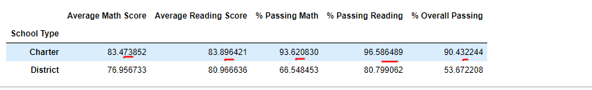

**SCHOOL DISTRICT ANALYSIS**

**Overview of the school district analysis:**

We are provided with two data files: School data and Student Data. We are going to do analysis for School District based on these two file. We will provide following deliverables:

- Clean the student data for any suffixes and prefixes.
- Replace the 9th grade reading and math scores at Thomas High School with NaN as management found the evidence of academic dishonesty.
- A high-level snapshot of the district's key metrics
- An overview of the key metrics for each school
- Top 5 and bottom 5 performing schools, based on the overall passing rate
- The average math score received by students in each grade level at each school
- The average reading score received by students in each grade level at each school
- School performance based on the budget per student
- School performance based on the school size
- School performance based on the type of school

**Results:**

- **How is the district summary affected?**

In District School Summary, we merged the Student data table and School data table and got the complete school data. After excluding the ninth grade students of Thomas High School from Total School count there was slight decrease in the Average Math Score, Average Reading Score, Percentage Passing Math, Percentage Passing Reading, and Percentage Overall Passing. We didn't see any change in the Average Reading Score at all. There was no significant change in data.

_NEW DISTRICT SUMMARY NaN:_

_DISTRICT SUMMARY WITHOUT NaN:_

- **How is the school summary affected?**

Firstly, we tried to get the data by grouping the schools by School Name, to get the Average Math Score, Average Reading Score, Percentage Passing Math, Percentage Passing Reading, and Percentage Overall Passing (including the Thomas High School Grade 9 Students). _The stats dropped_:

Then, we filtered on Thomas High School and the Grade 10, 11 and 12 to get the total students. (As we are not counting the Grade 9 students from Thomas High School-\> New Total Count=Total Student Count-Thomas High School Grade 9).

Based on the new student count we calculated the Average Math Score, Average Reading Score, Percentage Passing Math, Percentage Passing Reading, and Percentage Overall Passing. In the end, we replaced the Percentage Passing Math, Percentage Passing Reading, and Percentage Overall Passing with new values (based on Grade 10, 11 an d12 and Thomas High School). _The stats increased_:

- **How does replacing the ninth graders' math and reading scores affect Thomas High School's performance relative to the other schools?**

If we **included** the Ninth Graders count then the performance drastically affected. Their performance dropped and they reached the average 67 score and they came under bottom 5 schools.

But when we **excluded** the Ninth Graders from our Total count the Thomas High School remained in Top 5 schools and maintained their second place.

- **How does replacing the ninth-grade scores affect the following:**

    - _ **Math and reading scores by grade** _

We have "nan" for Thomas High School – Grade 9th for Reading Score and Math Score columns. The rest of the schools data was same for all the grades.

_Math Score_:

Reading Score:

    - _ **Scores by school spending** _

There was minor change in the $630-644 range which belongs to Thomas High School. There was not significant change in the data. If you round off the values (format the values), you will get same with and without NaN.

Data with NaN:

Data without NaN:

    - _ **Scores by school size** _

There was only minor change in the Medium (1000-2000) Range. There was not significant change. If we format the columns and round them off then the data will be same with and without NaN..

With NaN Value:

Without NaN value:

    - _ **Scores by school type** _

Again, there was only minor change in the "Charter" School Type. There is no significant change. If we format the columns and round them off then the data will be exact same with and without NaN.

Without NaN Value:

With NaN Value:

**Summary:**

We have observed that after replacing the Ninth Grade math and reading score to NaN:

1. All the stats for the Thomas High School just dropped down when we replaced the Ninth Grade when replaced with NaN.

With NaN (dropped):

2. The Thomas High School was in second rank earlier but after changing the Ninth Grade Score to NaN the Ranking dropped and the school came in bottom five.
3. When we excluded the Ninth Grade students from the Total Student count then the Thomas High School again gained the Rank 2.
4. Replacing the Ninth Grade score to NaN surely decreased the Thomas High School Score but when we just filtered on (or included) 10th, 11th and 12th grade data only there was no significant change in the Average Scores or Percentage. The stats remain almost same and the school maintained the ranking also.
